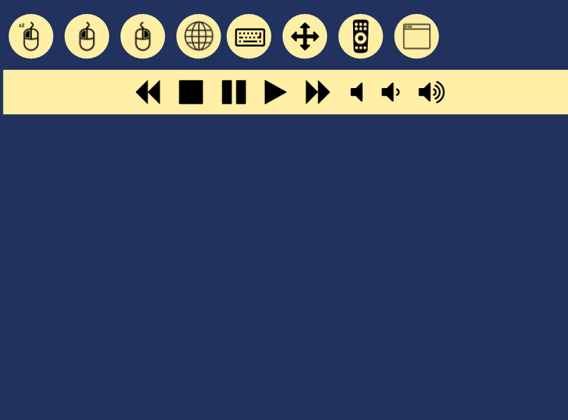

# Web Control

Simple node.js based website to control your media center. Includes arrow keys, media controls, keyboard (device native keyboard), applications launching and mouse control.

### Installation
Install node.js and npm is required. I've developed against node v4.4.7, npm v2.15.8. To check your installed version execute:

<code>node -v</code>

<code>npm -v</code>

Download the zip, extract and then go to project directory get all dependencies using:
<code>npm install</code>

### Execution
<code>node app.js</code>

### Configuration
configuration.json contains application configuration.

* port - Website's port
* browserPath - Path to browser executable

### Usage
Move on the blue surface to move the mouse. Click\double click the surface to click\double click the mouse.
Other controls are self explantory.
